# 📰 Press Kit

## About

AltStore is a third-party app store for iOS devices that allows users to sideload apps not available on the official App Store - no jailbreak required. With AltStore you can:&#x20;

* Easily sideload apps (.ipa files) downloaded on your device
* Manage third party sources to browse dedicated store pages and download apps directly&#x20;
* Automatically check for app updates in the background

For more technical information on how AltStore works, please check out the project's README on GitHub: [https://github.com/altstoreio/AltStore](https://github.com/altstoreio/AltStore)

## Links

Homepage: [https://altstore.io/](https://altstore.io/)

Twitter: [https://twitter.com/altstoreio](https://twitter.com/altstoreio)

Mastodon: [https://fosstodon.org/@altstore](https://fosstodon.org/@altstore)

GitHub: [https://github.com/altstoreio/AltStore](https://github.com/altstoreio/AltStore)

## Files


Includes all below images. You can also right-click all images to save full-resolution versions.


## App Icon

<figure><figcaption>
Full Icon
</figcaption></figure>

 

<figure><figcaption>
Rounded App Icon
</figcaption></figure>

## Framed Screenshots

<figure>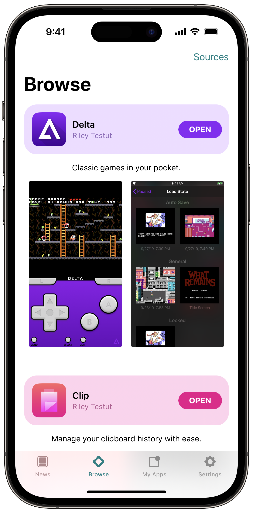<figcaption>
Browse Tab
</figcaption></figure>

 

<figure>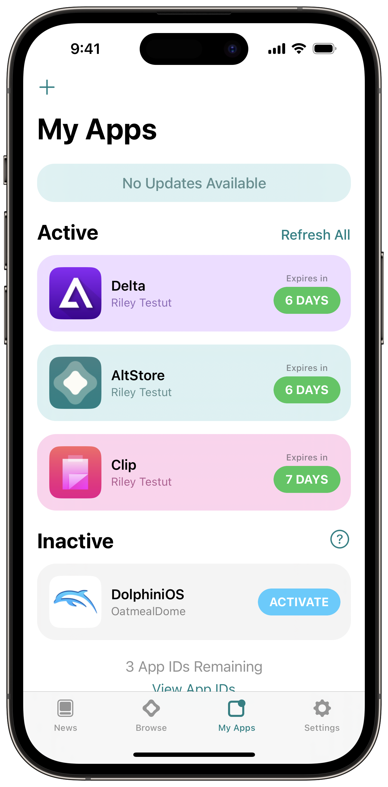<figcaption>
My Apps Tab
</figcaption></figure>

<figure>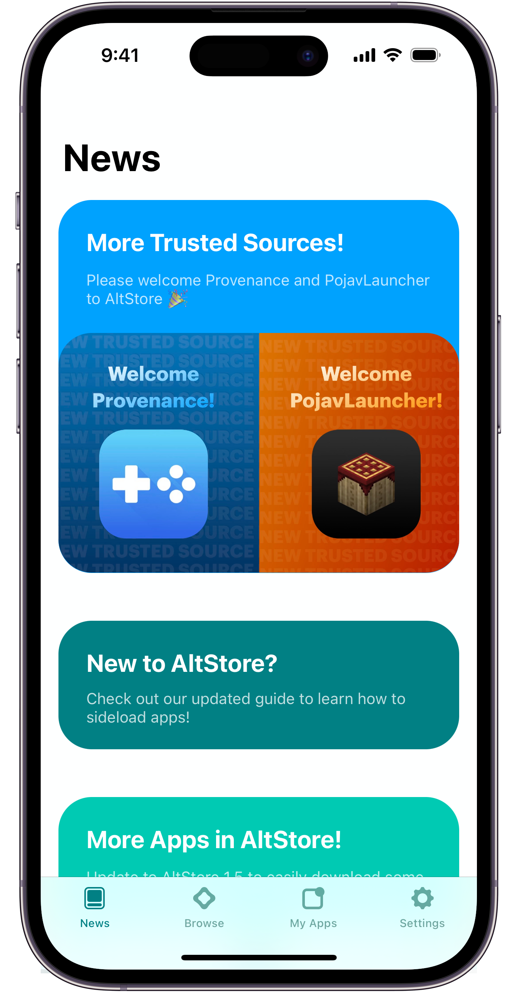<figcaption>
News Tab
</figcaption></figure>

 

<figure>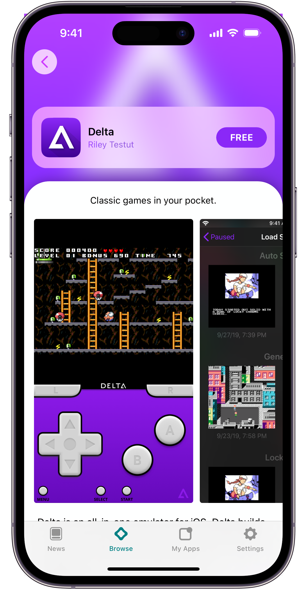<figcaption>
App Store Page
</figcaption></figure>

<figure>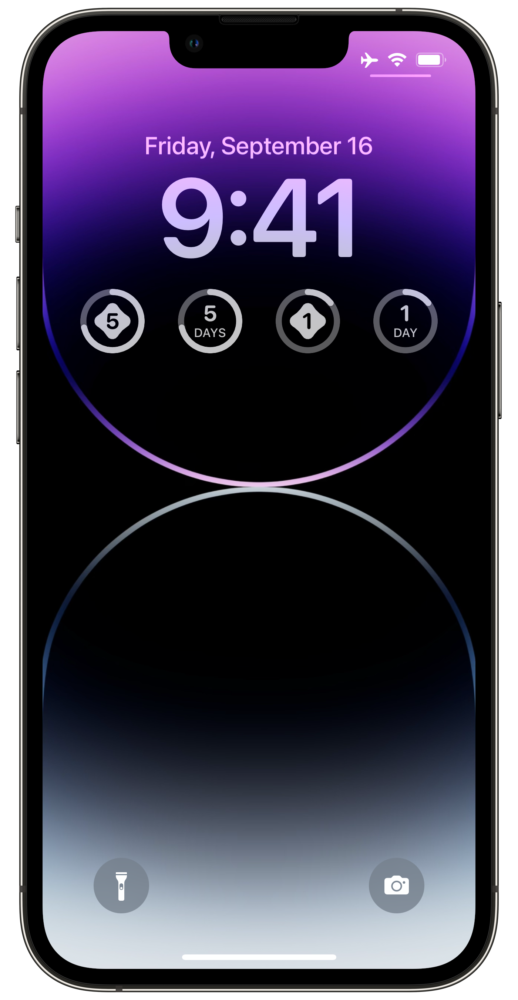<figcaption>
Lock Screen Widget
</figcaption></figure>

 

<figure>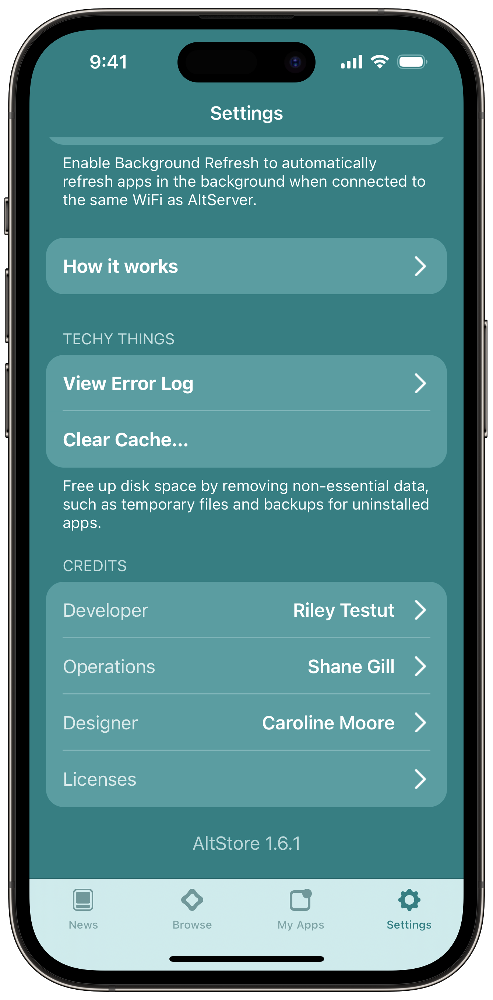<figcaption>
AltStore Settings
</figcaption></figure>

<figure><figcaption>
Trusted Sources Page
</figcaption></figure>

 

<figure>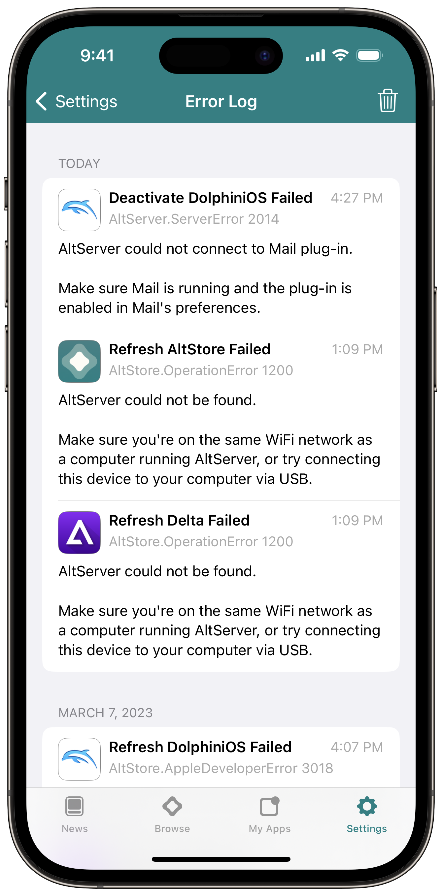<figcaption>
Error Log
</figcaption></figure>

## Screenshots

<figure>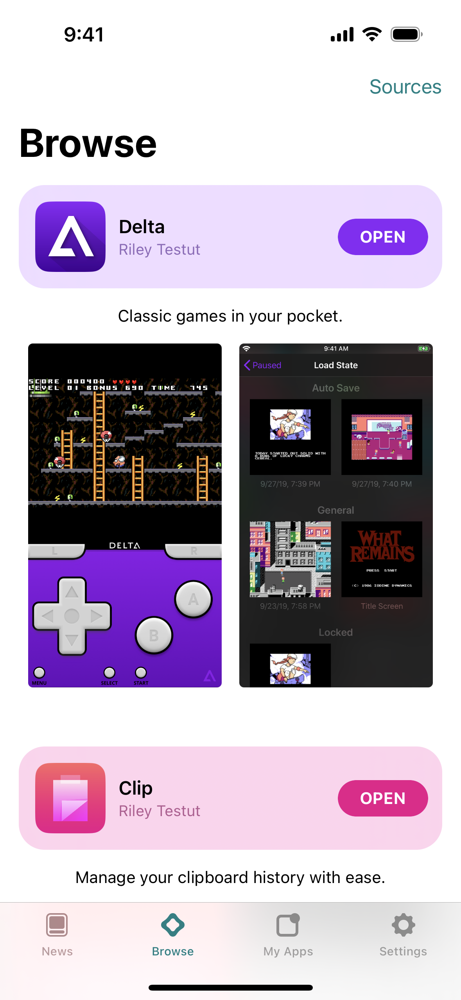<figcaption>
Browse Tab
</figcaption></figure>

 

<figure><figcaption>
My Apps Tab
</figcaption></figure>

<figure>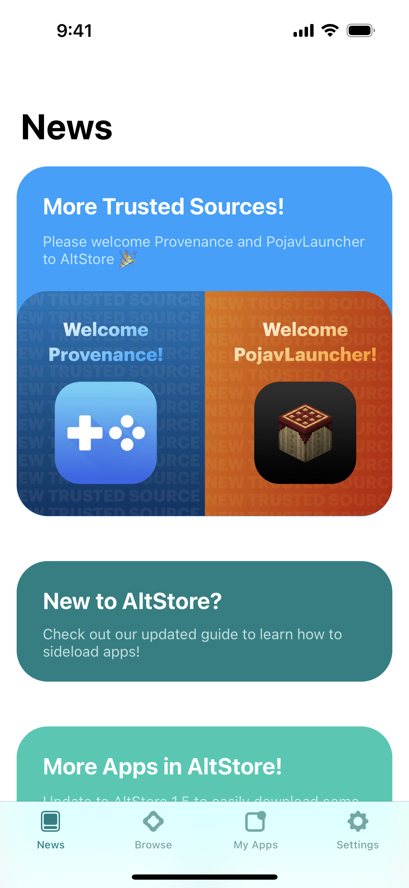<figcaption>
News Tab
</figcaption></figure>

 

<figure>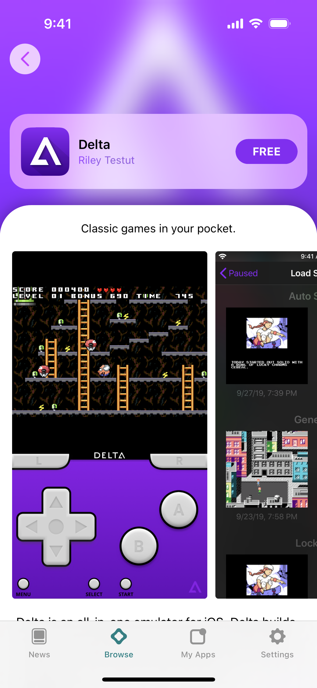<figcaption>
App Store Page
</figcaption></figure>

<figure>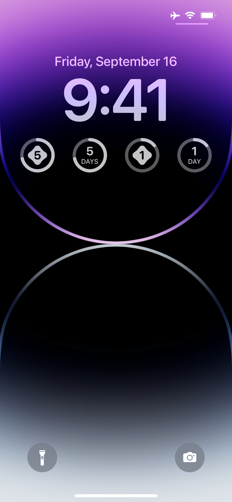<figcaption>
Lock Screen Widget
</figcaption></figure>

 

<figure>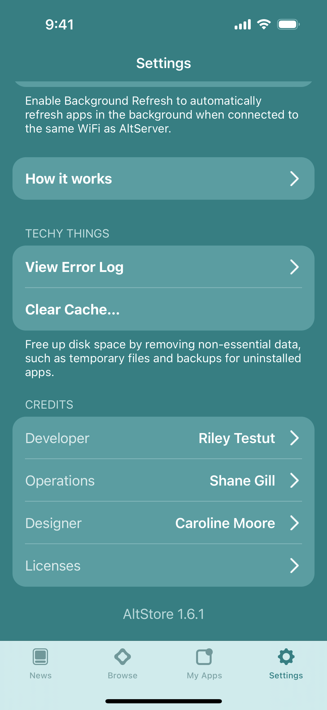<figcaption>
AltStore Settings
</figcaption></figure>

<figure>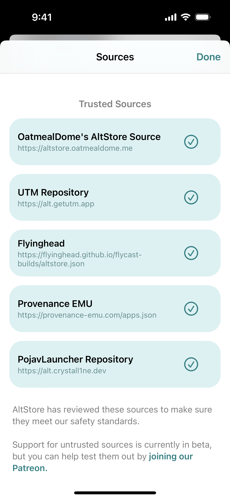<figcaption>
Trusted Sources
</figcaption></figure>

 

<figure>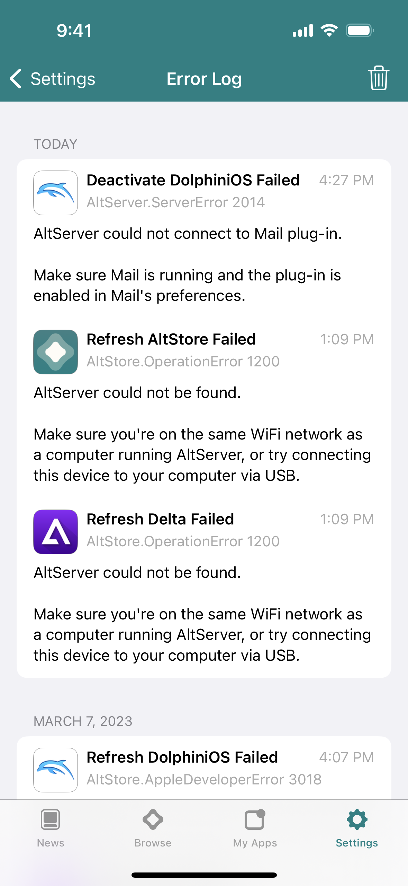<figcaption>
Error Log
</figcaption></figure>

## Promo Images

<figure>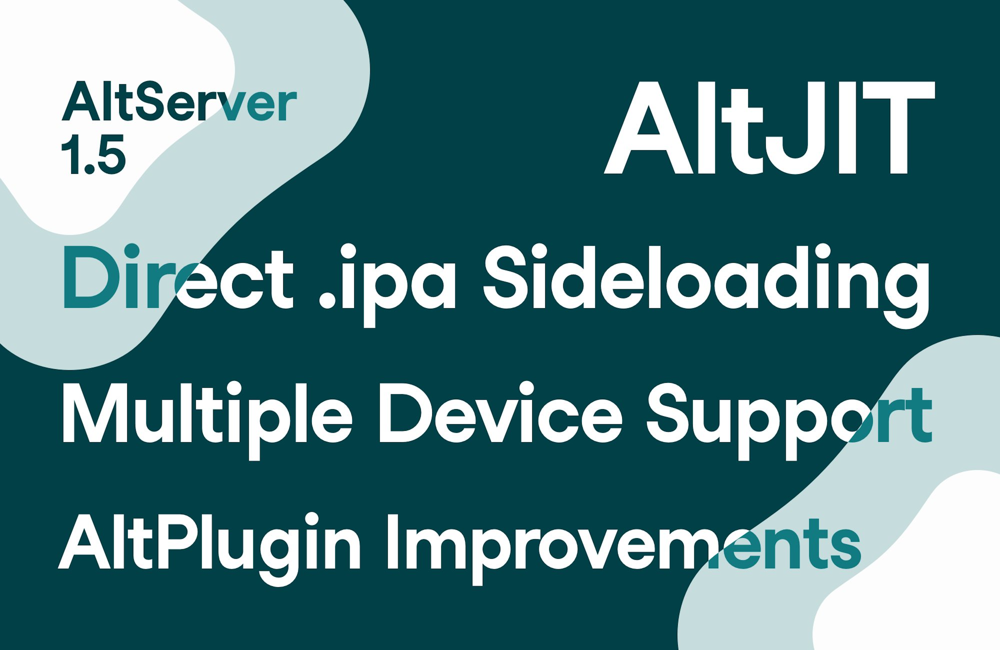<figcaption>
AltStore 1.5 Launch
</figcaption></figure>

<figure><figcaption>
AltStore 1.6 Launch
</figcaption></figure>

<figure><figcaption>
3yr Anniversary
</figcaption></figure>

<figure>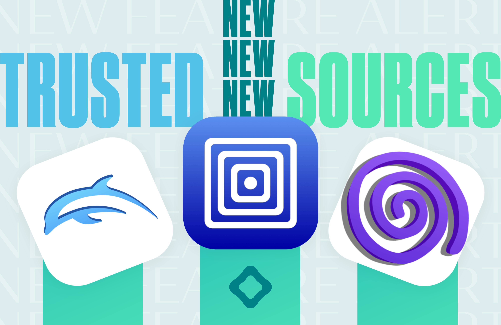<figcaption>
Trusted Sources Announcement
</figcaption></figure>

<figure><figcaption>
New Feature: Sideloading Apps
</figcaption></figure>

<figure><figcaption>
More Trusted Sources Added
</figcaption></figure>
