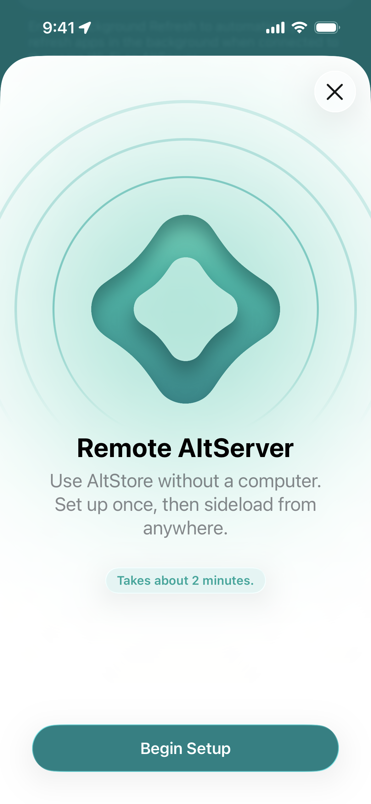
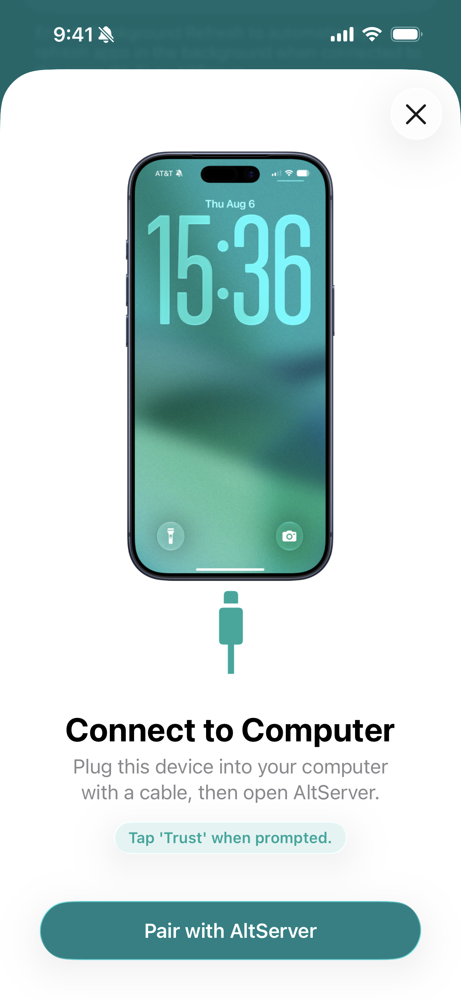
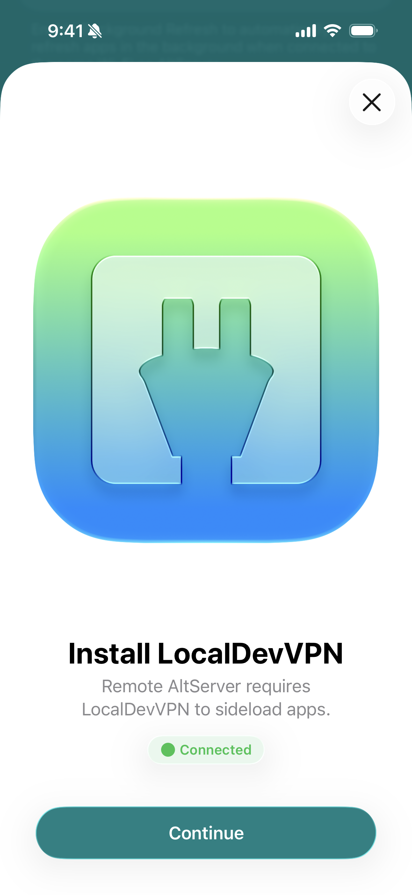
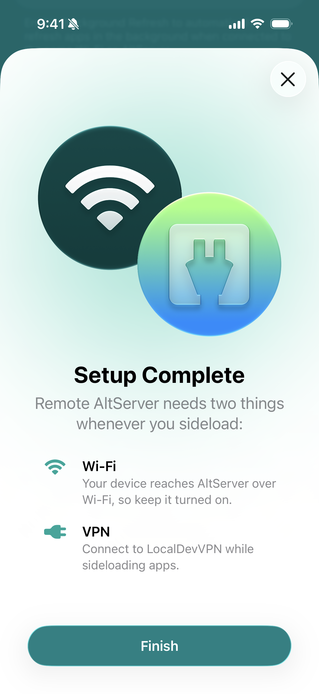

# 🌐 Remote AltServers

Remote AltServers allow you to use AltStore Classic to install and refresh apps from anywhere — without a computer!&#x20;

### Set Up

To start using Remote AltServers, just tap "Set up Remote AltServer..." under Remote AltServer in AltStore's settings and follow the in-app instructions.

<figure><figcaption>
Step 1. Tap "Set up Remote AltServer..." to begin setup
</figcaption></figure> <figure><figcaption>
Step 2. Pair with a PC
</figcaption></figure> <figure><figcaption>
Step 3. Install LocalDevVPN
</figcaption></figure> <figure><figcaption>
Step 4. Ensure Wi-Fi and VPN are enabled.
</figcaption></figure>

### Usage Instructions

1. Connect to LocalDevVPN
2. Connected to WiFi **(not cellular)**
3. **DONE!** You can now use AltStore to sideload and refresh your apps without connecting to AltServer on your computer. 

### Remote AltServer Troubleshooting Tips

**AltStore couldn't reach remote AltServer**

If you receive this error, please make sure you're connected to WiFi and LocalDevVPN

**Remote AltServer sent invalid response**

Try again in a few minutes or choose another remote AltServer

**The remote AltServer "\[server]" is currently unavailable**

If you receive this error, you may need to wait until the server is back online or you can choose an alternate server in the remote AltServer settings.


If you have issues, you can try picking a different remote AltServer by tapping "Choose Server" in AltStore's settings.


