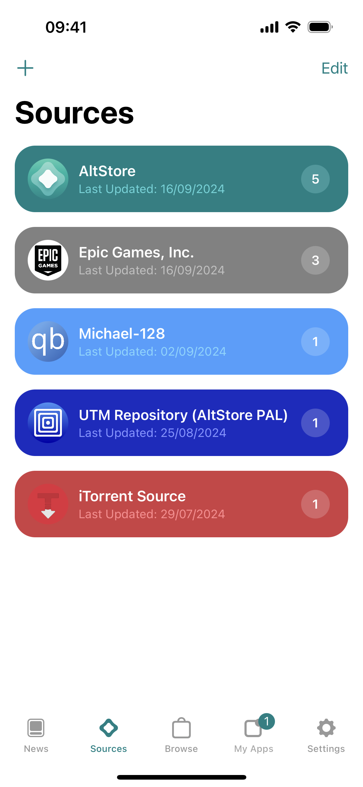
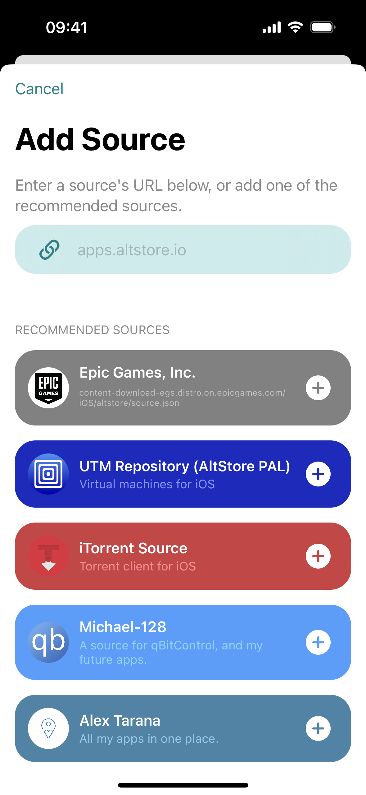

# 🔗 Sources

Sources are links to apps provided by developers and they control what apps are available to download through AltStore PAL. When you find an app you want to download from AltStore PAL, just add the source from the developer's website and their apps will appear in the Browse tab.&#x20;

To add and manage sources, first go to the Sources tab. From there you can add a source by tapping the ”+” button and enter the source's URL.&#x20;


Not sure where to start? Try adding one of our Recommended Sources!


<figure><figcaption></figcaption></figure>

 

<figure><figcaption></figcaption></figure>

