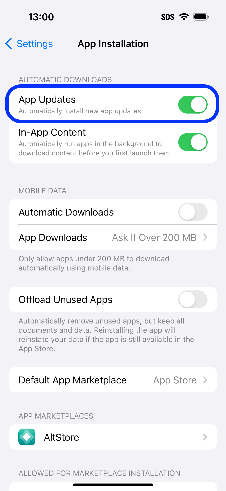
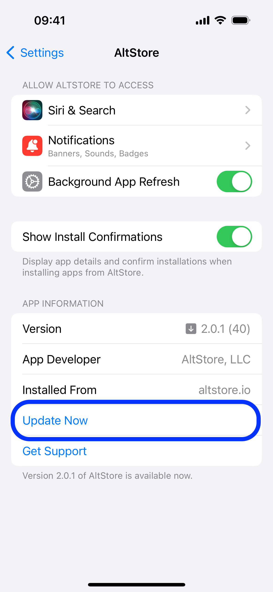

# 🔼 Updating PAL

Unlike apps distributed with AltStore, AltStore PAL itself cannot be updated from the My Apps tab. Instead, there are two ways to update it  - automatically in the background, or manually from Settings.

### Background Updates

1. Go to Settings -> App Installation
2. Turn on "App Updates" under Automatic Downloads
3. AltStore should update itself within 24 hours after an update is released

<figure><figcaption>
Toggle On "App Updates" 
</figcaption></figure>

### Update Manually

1. Go to Settings -> App Installation -> AltStore
2. Tap "Update" under App Information


You may need to wait up to 24 hours for the update to appear.


<figure><figcaption>
Option will appear if App Updates are off
</figcaption></figure>
