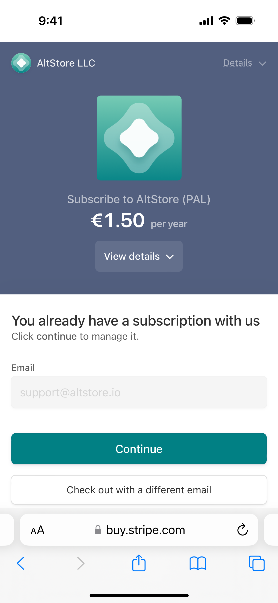

# ⬇️ Updating

Apple currently does not allow marketplace apps to update themselves, so please follow the below instructions to update AltStore PAL manually:

1. Go to the [altstore.io](https://altstore.io/#Downloads) "Downloads" section
2. Tap the "1.50/year + VAT"
3. Follow the below instructions depending on your original payment method.&#x20;


**You will not be charged again**


### <mark style="color:purple;">Credit Card</mark>

Just type in the email address you used to sign up and Stripe will automatically recognize you have a subscription and offer to redirect you to the AltStore PAL download page. You do not need to re-subscribe 🙂

<figure><figcaption>
Enter your email
</figcaption></figure>

 

<figure><figcaption>
Tap 'Continue'
</figcaption></figure>

 

<figure><figcaption>
Tap 'Download'
</figcaption></figure>

### <mark style="color:purple;">Apple Pay</mark>

If you used Apple Pay, you will need to attempt to re-subscribe. Once you do this, you will be taken to a screen saying the payment did not process along with a link to the download screen. You will not be charged again 🙂


If you did not use the Hide My Email feature, you can also just follow the instructions above for credit cards.


<figure><figcaption>
Tap Apple Pay
</figcaption></figure>

 

<figure><figcaption>
Attempt to Pay Again
</figcaption></figure>

 

<figure><figcaption>
Tap "Continue"
</figcaption></figure>

 

<figure><figcaption>
Tap "Download"
</figcaption></figure>

