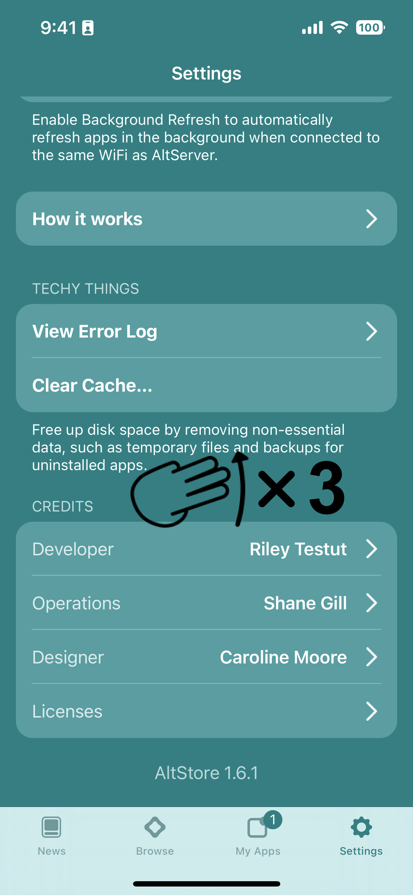

# 🐮 MacDirtyCow


MacDirtyCow requires iOS 14.0-16.1.2 (excluding 15.7.2)

**iOS 16.2 or later is not supported**


1. Download WDBRemoveThreeAppLimit.ipa [from GitHub](https://github.com/zhuowei/WDBRemoveThreeAppLimit/releases/tag/v1.0)&#x20;
2. Sideload the .ipa with AltStore
3. Open WDBRemoveThreeAppLimit and tap ‘Go’
4. Return to AltStore and open Settings tab
5. Swipe up with 3 fingers 3 times to reveal MacDirtyCow section
6. Disable “Enforce 3-App Limit”&#x20;
7. You can now install more than 3 apps!


You are still limited to 10 App IDs at a time


&#x20;

&#x20;                
