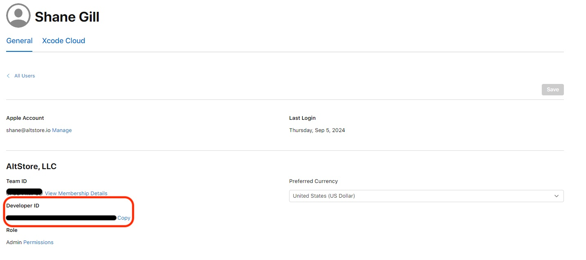
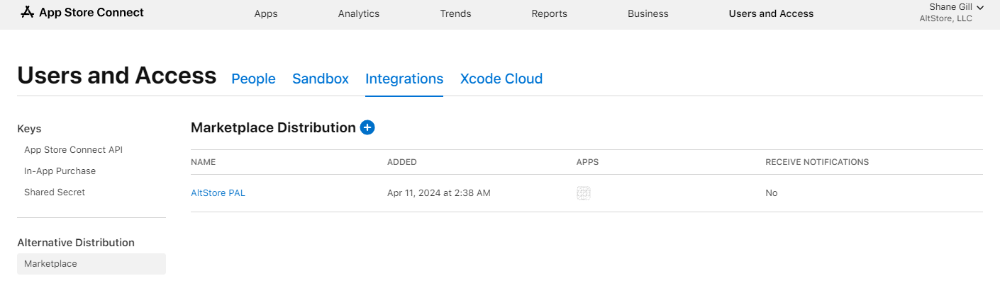

# 🛒 Distribute with AltStore PAL

Distributing your app with AltStore PAL is similar to what you may be used to when submitting to the Apple App Store. You will still submit apps through App Store Connect using your paid Apple Developer account, so make sure you are set up with one before proceeding. The only major difference is that your apps will only be available in the EU.


You **do not** have to be located in or have a business in the EU to distribute your apps with AltStore PAL.


When ready, follow each of the steps outlined below to begin distributing your apps on AltStore PAL 🙂

Agree to Alternative EU Terms Addendum

The Alternative EU Terms Addendum is an additional agreement you must make with Apple in order to distribute your apps outside the App Store.&#x20;

You can find and agree to the terms in App Store Connect from your account page under Agreements. You must have a paid Apple developer account.

**Note:** The new terms will change your commission rates and fees for apps distributed in the EU. [Learn More](https://developer.apple.com/support/core-technology-fee/)

Add AltStore PAL as an alternative marketplace

Before you can submit your apps to AltStore PAL, you must prepare your developer account for distribution with alternative marketplaces

1.  Email your Developer ID to [apps@altstore.io](mailto:apps@altstore.io). You can find your Developer ID in App Store Connect by selecting "Edit Profile" in the top right.

    <figure><figcaption></figcaption></figure>

<!---->

2.  You will receive a response with a security token. In App Store Connect, go to Users and Access -> Integrations -> Marketplace, click '+' and input the token.

    <figure><figcaption></figcaption></figure>

<!---->

3. Select the app(s) you want to distribute with AltStore PAL. You can change this at any time.
4. Select "Yes, send notifications" on the next screen to let AltStore PAL process your apps automatically (recommended).

**All apps must be processed by AltStore PAL before they can be distributed.** If you don't want AltStore PAL to process your builds automatically, you can manually process them using our [REST API](adp-rest-api.md).

Submit your app(s) for Notarization

Even though you are distributing outside the App Store, you still need to submit your app(s) to Apple for Notarization before they can be distributed. This is similar to Apple's App Store review process but fewer guidelines. For more detailed instructions, see Apple's [Notarization](https://developer.apple.com/help/app-store-connect/distributing-apps-in-the-european-union/submit-for-notarization) support page.

1. Select your app in App Store Connect
2. In the App Review section, click Edit under "Review Type".
3. Select "Notarization" as the review type and click Save.
4. Submit app(s) for review.

**If you still plan to distribute your app through the Apple App Store, you can skip this step.** Your apps will be automatically notarized when approved for the App Store.

Host your Alternative Distribution Package (ADP)

Once Notarized, you'll need to download your app's ADP to then host it on your server.

1. Download your ADP using our [REST API](adp-rest-api.md#download-adp).
2. Upload the complete package to your server. You must preserve the directory hierarchy exactly.

Create a source

Once your server is updated with your app's ADP, the last step is to [make a source](make-a-source.md), which is just a JSON file with information about your app(s).

Once you've made your source, anyone can now add the URL to download your apps!

