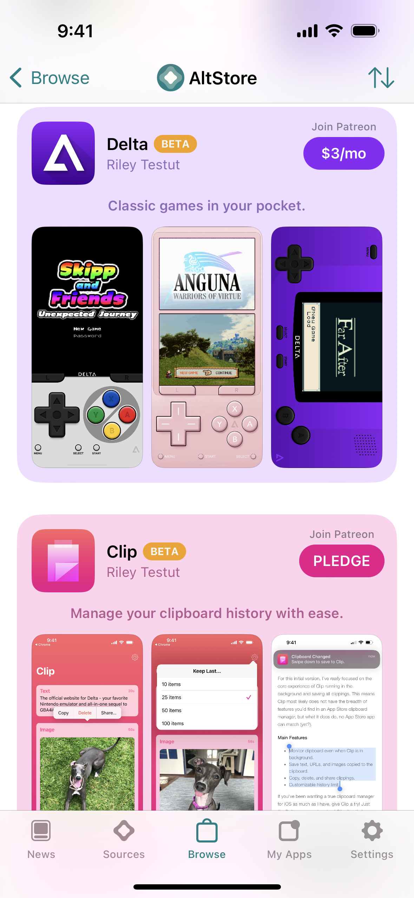
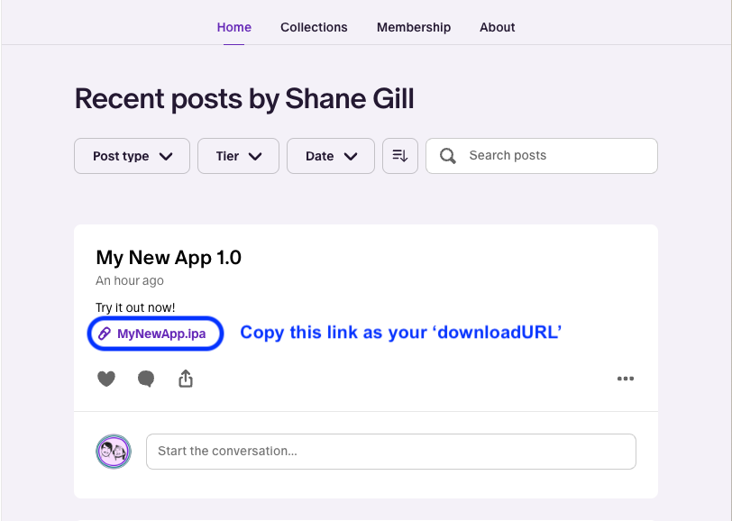

# 🅿 Patreon Integration

## Overview

Apps in AltStore are all free by default, but by creating a Patreon campaign you can choose to offer your apps exclusively to Patrons.

Members of your Patreon can connect their accounts to download any apps they have access to. Once a user installs your app, they'll be able to refresh it and receive updates through AltStore as long as they remain a Patron.&#x20;


You can assign as many apps as you like to a single Patreon campaign. In other words, you don't need individual campaigns for each app in your source.


## How it Works

By default, apps marked as Patreon-only will show "Join Patreon" above the download button and be visible to everyone. When an app is downloaded, AltStore will first authenticate with Patreon to verify they are a patron. If they are not a patron, AltStore will direct them to your Patreon page instead.&#x20;

You can optionally limit app downloads to certain tiers by specifying the minimum pledge required in your source JSON. Additionally, you can choose to hide an app from non-Patrons completely. [Learn more](make-a-source.md#patreon-apps)


If provided, the minimum pledge amount will be shown as the app's monthly price. For this reason, we recommend **always** providing a minimum pledge amount, even if you only have one tier.


<figure><figcaption></figcaption></figure>


For more fine-grain control, you can specify the exact tiers required for each app in your source's JSON. [Learn more](make-a-source.md#patreon-apps)


## Expired Pledges

Once a user's pledge expires, they'll no longer receive updates for your app(s) or be able to refresh them. This will cause these apps to expire after 7 days, after which they will no longer be able to be opened.

If they become a Patron again in the future, they will be able to use your apps like normal.

## Instructions

#### Upload the IPA


AltStore uses the Patreon API to ensure only Patrons can download your app. This requires attaching your .ipa file to a Patreon post, which has a limit of 200MB.


1. Create a new Patreon Post
2. Attach your .ipa file
3. Configure post visibility to limit which tiers can download it
4. Publish Patreon Post
5. Right-click the attachment and copy the URL

<figure><figcaption></figcaption></figure>

#### Update Your Source

1. Create a new [App](make-a-source.md#apps) entry in your source JSON
2. Use the copied attachment URL for your app's `downloadURL`
3. Add a [Patreon](make-a-source.md#patreon-apps) object to your app's entry with the conditions required to download it (this should match the visibility of your Patreon post).
4. If not yet added, add the `patreonURL` key to your source JSON with your Patreon page's URL (e.g https://www.patreon.com/rileyshane)
5. Upload your source JSON to your server
