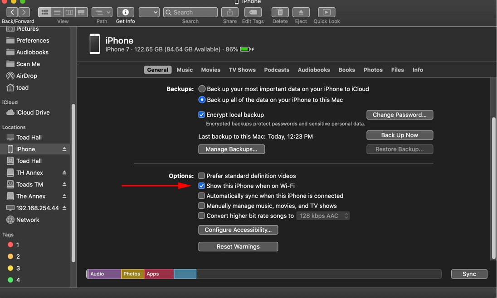

# How to Install AltStore

1. Download AltServer for Mac ([https://altstore.io](https://altstore.io))
2. Copy “AltServer.app” to your Applications folder.



3\. Launch AltServer (it will appear as an icon in the menu bar).



4\. Connect your iPhone to your computer and make sure it is unlocked.

5\. Trust your iPhone with your computer (if needed).

6\. Wi-Fi sync your iPhone:

* (Mojave) Open iTunes and enable iTunes Wi-Fi sync for your phone

* (Catalina) Open Finder and enable “Show this iPhone when on WiFi” for your phone.

7\. Click the AltServer icon in the Mac menu bar, click “Install AltStore”, then choose your phone

* ****:octagonal\_sign: **** [**For "Install Mail Plug-in" notification, follow the instructions on next page.**](enable-mail-plug-in.md)****

8\. Enter your Apple ID email and password (NOTE: both email address and password are case sensitive).



10\. Wait a few seconds, then AltStore will be send a notification that it has been successfully installed to your phone (if you don't get this notification, try restarting your iOS device). Restart your device and AltStore should appear.&#x20;

* <mark style="color:purple;">AltStore may show "Untrusted Developer" notification. If this is the case, on your iOS device go to Settings -> General -> VPN & Device Management. Tap on your Apple ID under "Developer App" and then tap "Trust" twice.</mark>&#x20;

