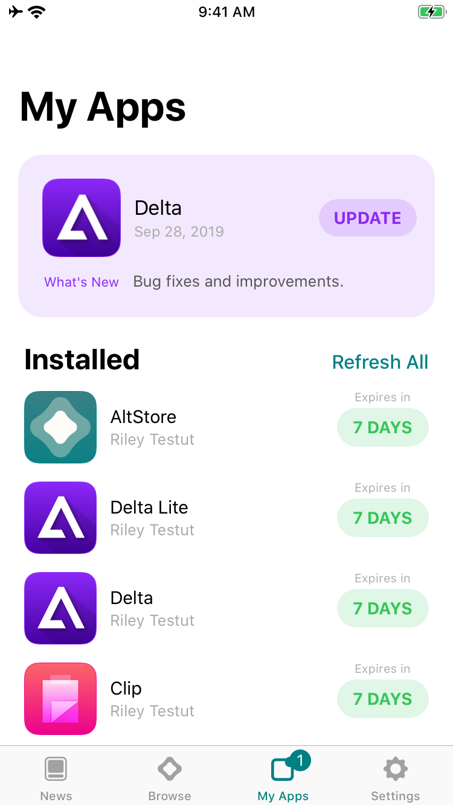

# 🛍 Your AltStore

This guide is for the public version of AltStore. For added features (like adding more apps to your AltStore) you can sign up for the [Patreon ](https://www.patreon.com/rileytestut)to get access to the beta version of AltStore.&#x20;

To learn more about the beta, you can continue [here](../patreon/beta-features.md)

## Browse

The "Browse" tab in AltStore is where you can find Apps available for you to sideload.&#x20;

&#x20;                                                .png>)

From the browse tab you can also add sources, which allows you to put additional apps in your AltStore. [To learn more about sources, continue here](features/sources.md)

## My Apps

The "My Apps" tab is where you can see all of your activated/deactivated apps  &#x20;

&#x20;                                                

### Activations&#x20;

Though you can install several apps, you can activate only three apps at a time. When you download an app, it will be activated by default. But if you try to activate more than 3 apps, you will be prompted to deactivate a different app. You can re-activate an app by clicking the activate button in your apps list.

&#x20;                                                                &#x20;

### AppIDs Limit

Apps on AltStore also use up "App IDs" when they are downloaded. You can only use a total of 10 App IDs per week, and each app uses a different amount of App IDs. Be sure to use the "view App IDs" link to see how many each app is using.&#x20;

&#x20;                                              
